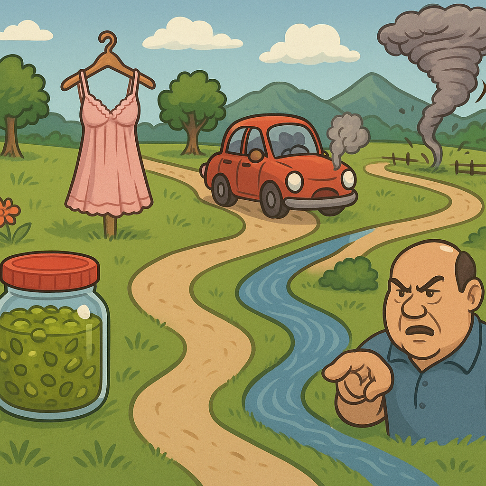
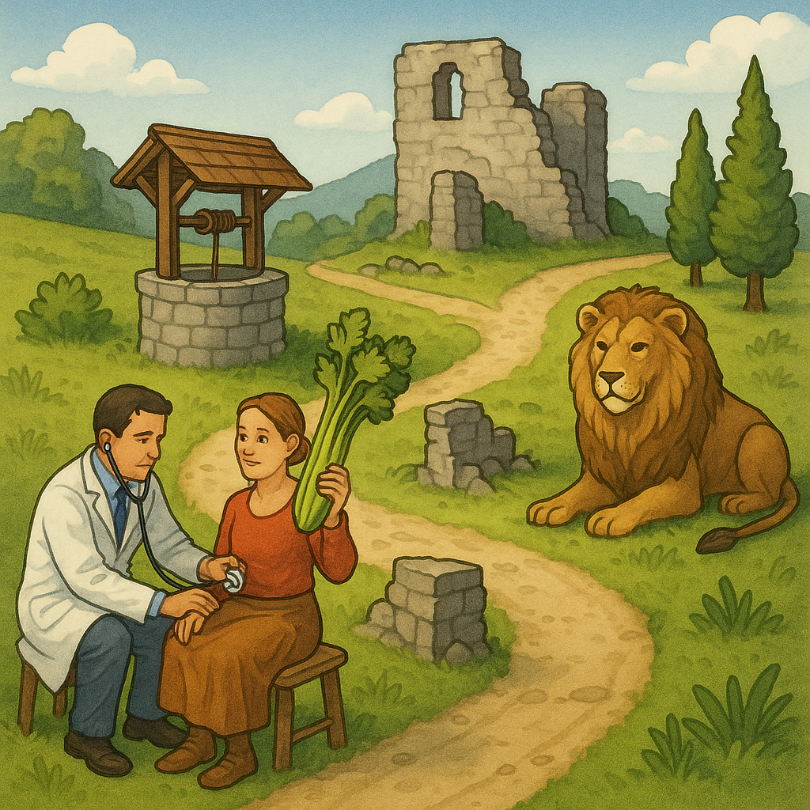

# word2img

Generate an image from a list of words using OpenAI's `gpt-image-1` model. Useful for remembering lists of words. 

## Requirements

- Python 3.10+

## Install

```bash
pip install -e .
```

## API usage

```python
from word2img import words_to_img

result = words_to_img(["frog", "does", "dancing"], api_key="your_api_key")
with open("frog-does-dancing.png", "wb") as f:
    f.write(result["image_bytes"])
```

By default, `words_to_img(...)` uses the `loci` prompt style: one memory-palace scene with the words placed in order along a path.
Override with `prompt_type="normal"` for the original hyphen-joined prompt or `prompt_type="scene"` for a single surreal mnemonic scene.

## CLI usage

```bash
python -m word2img
```

Or choose a prompt style explicitly:

```bash
python -m word2img --prompt-type normal
```

You will be prompted for:
- Comma-separated words (for example `frog,does,dancing`)
- OpenAI API key on first run only (hidden input)

The CLI stores the API key in the system keyring and writes `<prompt>.png` to the current directory.

## EFF passphrase + image mnemonic

Generate an EFF-style passphrase using computer randomness, then generate an image for it:

```bash
python -m word2img.effgen
```

Or via installed script:

```bash
word2img-effgen
```

Options:
- `-n`, `--num-words`: number of words (default: `6`)
- `--mnemonic-mode`: `loci` (default) or `scene`
- `--lang`: translate the selected passphrase before generating the mnemonic image. Example: `--lang no` for Norwegian

On first run, the tool downloads and caches the official EFF large wordlist at `~/.cache/word2img/eff_large_wordlist.txt`.
Default mode is `loci`: one geographic memory-palace image with landmarks in strict passphrase order.
All modes explicitly instruct the model to avoid rendering any text/letters in the image.

## Examples

English `effgen` output:

Passphrase: `relish negligee exhaust sinuous browbeat twister`



Norwegian `effgen --lang no` output:

Passphrase: `diagnoser selleri mened ruiner løve rutine`



Passphrase: `stikkende utpressing uprøvd ubehag jubel utvikle`


